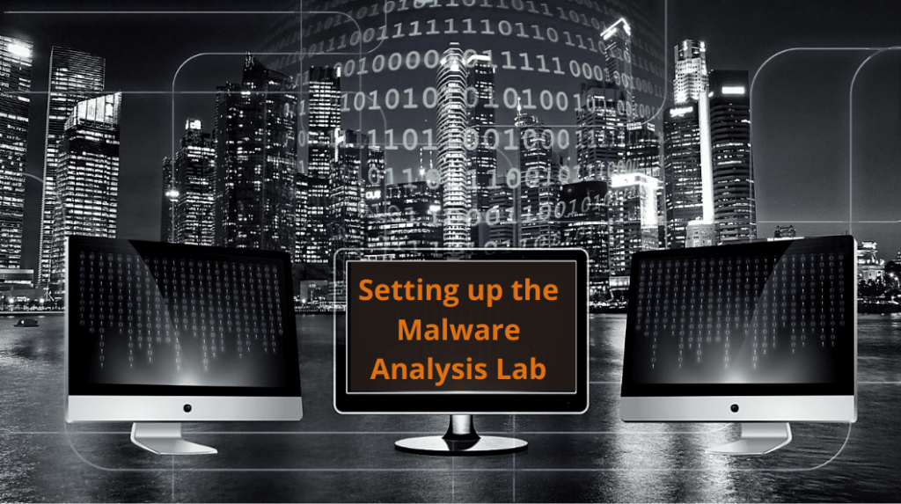

<h1 align="center">
          Malware Lab Environment Setup
          [Ubuntu-gateway | Windows11-lab]
</h1>
<p align="center">
          
</p>

> **Note:** This gateway configuration is intended for malware analysts and researchers who prefer to work with *live malware samples* in order to capture real IOCs, observe C2 behavior, and conduct full traffic analysis.  
>
> This setup contrasts with simulated environments like **INetSim**, which provide fake responses and do not allow external communication.  
>
> By enforcing a VPN-tunneled, monitored connection through the Ubuntu Gateway, this lab balances *real-world visibility* with *outbound containment and safety*.

> **CAUTION:** While this guide provides a consistent baseline, be aware that **Ubuntu may behave differently across installs**, even on the same physical machine or virtual environment. Factors such as kernel version (in my case *Ubuntu Desktop 25.4* *6.14.0-15-generic*), NetworkManager quirks, VMware device enumeration, and interface race conditions at boot can affect behavior. Always test connectivity, interface names, and routing rules after setup. Don’t just assume one snapshot will behave identically across clones or reinstalls.


## Network Topology (ASCII Diagram)
> **All steps assume you're running VMware Fusion on macOS, with both the Ubuntu Gateway and Windows 11 VM hosted in the same virtual environment.**

```text
          [Internet]
              |
         [VMware NAT] (ens33)
              |
      +------------------------------------+
      |   Ubuntu Gateway VM                |
      | ---------------------------------- |
      | NAT: 192.168.x.x (ens33)           |
      | Host-only: 10.37.129.10 (ens37)    |
      | VPN: nordlynx (paid plan required) |
      +------------------------------------+
              |
        Host-Only Network
       (Private to my Mac)
              |
      +--------------------------+
      |   Windows 11 VM          |
      | ------------------------ | 
      | Host-only: 10.37.129.50  |
      +--------------------------+
```

### VMware Configuration:

> Establishing a dual-NIC virtual environment where one NIC connects to the internet via Ubuntu Gateway, and the other isolates traffic for analysis.

#### Step 1: Create a Windows 11 VM

* Select a Windows 11 Pro arm64 ISO
* Use EFI boot and UEFI Secure Boot if needed
* Choose "Custom" hardware setup

#### Step 2: Add a Host-Only (Private to my Mac) Network Adapter

1. In VMware **Settings** → **Network Adapter**:
2. Click **Add Device**
3. Set `Network Adapter 2` to:

   * **Network Type**: `Host-Only` (this will route through Ubuntu)
   * **Optional**: Rename this adapter to `LabNet` in Windows for clarity, however this guide is purely built for Mac setups

VM Settings → Add Device → Network Adapter → Private to my Mac (Host-Only)


This guide explains how to configure an Ubuntu-based gateway VM that allows internet access to a Windows malware lab VM (Str4yVM) **only when a NordVPN tunnel is active**. It uses `iptables`, `systemd`, and static IP configuration for a robust, reboot-persistent setup.

> ⚠️ Before starting, ensure you have a **paid NordVPN account**. On the Ubuntu Gateway, run `sh <(curl -sSf https://downloads.nordcdn.com/apps/linux/install.sh)` to install, then `nordvpn login`, and verify connection with `nordvpn status`. Failsafe script setup at 


---


## 1. Static IP Setup

> Configure a persistent, manual IP address for the Ubuntu Gateway’s host-only interface (`ens37`) to ensure consistent routing and identification within the malware lab subnet.
>
> **Note:** please check your device name (*ens33* & *ens37* in my case) and replace the *ens* numbers in this guide as per details shown in `ip a` table. Chosen static IP addresses can be anything as long as they are within the same network `10.37.129.*` (in my case I just went with `10` & `50` for the last octet).

### Interface Overview

* `ens33`: NAT (VMware DHCP) - `192.168.x.x`
* `ens37`: Host-only - `10.37.129.10/24`
* `nordlynx`: VPN tunnel (via NordVPN)

### Command

```bash
sudo nmcli con add type ethernet con-name ens37-static ifname ens37 ip4 10.37.129.10/24
sudo nmcli con up ens37-static
```

---

## 2. Routing & NAT Script

> Create a reusable shell script that configures IP forwarding and NAT routing, allowing the Windows VM to access the internet through the Ubuntu Gateway. `touch /usr/local/bin/fix-lab-routing.sh`

**Path:** `/usr/local/bin/fix-lab-routing.sh`

```bash
#!/bin/bash

while ! ip link show ens37 | grep -q "state UP"; do sleep 1; done

ip route add 10.37.129.0/24 dev ens37
ip rule add to 10.37.129.0/24 table main

echo 1 > /proc/sys/net/ipv4/ip_forward

iptables -F
iptables -t nat -F
iptables -X

iptables -P FORWARD ACCEPT
iptables -P INPUT ACCEPT
iptables -P OUTPUT ACCEPT

iptables -t nat -A POSTROUTING -o ens33 -j MASQUERADE
iptables -A FORWARD -i ens37 -o ens33 -j ACCEPT
iptables -A FORWARD -i ens33 -o ens37 -m state --state RELATED,ESTABLISHED -j ACCEPT

iptables -t nat -A POSTROUTING -s 10.37.129.0/24 -o nordlynx -j MASQUERADE

echo "[+] Routing setup complete at $(date)" >> /var/log/fix-lab-routing.log
```

Make it executable:

```bash
sudo chmod +x /usr/local/bin/fix-lab-routing.sh
```

---

## 3. Boot-Time Auto-Start via systemd

> *Persistency setting!* Ensure the NAT and routing setup script is executed automatically on each boot to preserve lab networking without manual intervention.

**Path:** `/etc/systemd/system/fix-lab-routing.service`

```ini
[Unit]
Description=Routing/NAT for Malware Lab
After=network-online.target
Wants=network-online.target

[Service]
Type=oneshot
ExecStart=/usr/local/bin/fix-lab-routing.sh
RemainAfterExit=true

[Install]
WantedBy=multi-user.target
```

Enable and start:

```bash
sudo systemctl daemon-reload
sudo systemctl enable fix-lab-routing.service
sudo systemctl start fix-lab-routing.service
```

---

## 4. VPN Watchdog as systemd Timer


> **Purpose:** Monitor NordVPN connection status and dynamically enable or disable NAT routing to the Windows VM based on VPN availability, enforcing strict outbound security.
>
> This *systemd* timer continuously checks whether NordVPN is connected. If it is, it enables NAT routing so the Windows VM can access the internet. If the VPN disconnects, it immediately disables the routing rules to prevent any outbound traffic — acting as a failsafe to ensure all malware traffic remains tunneled.
>
> This makes it impossible to accidentally expose malware traffic directly to the internet if the VPN drops.


**Script:** `/usr/local/bin/vpn-watchdog.sh`

```bash
#!/bin/bash

LOG="/var/log/vpn-watchdog.log"
DATE=$(date '+%Y-%m-%d %H:%M:%S')

VPN_STATUS=$(nordvpn status 2>/dev/null | grep "Status" | awk '{print $2}')

if [[ "$VPN_STATUS" == "Connected" ]]; then
  echo "$DATE [+] VPN connected. Ensuring lab routing..." >> $LOG
  /usr/local/bin/fix-lab-routing.sh
else
  echo "$DATE [!] VPN NOT connected. Flushing MASQUERADE rules to cut off lab." >> $LOG
  iptables -t nat -D POSTROUTING -s 10.37.129.0/24 -o nordlynx -j MASQUERADE 2>/dev/null
  iptables -D FORWARD -i ens37 -o nordlynx -j ACCEPT 2>/dev/null
fi
```

```bash
sudo chmod +x /usr/local/bin/vpn-watchdog.sh
```

**Service:** `/etc/systemd/system/vpn-watchdog.service`

```ini
[Unit]
Description=VPN Watchdog - Enforce NAT only if VPN is up

[Service]
Type=oneshot
ExecStart=/usr/local/bin/vpn-watchdog.sh
```

**Timer:** `/etc/systemd/system/vpn-watchdog.timer`

```ini
[Unit]
Description=Runs vpn-watchdog.sh every 1 minute

[Timer]
OnBootSec=30s
OnUnitActiveSec=60s
Unit=vpn-watchdog.service

[Install]
WantedBy=timers.target
```

Enable the timer:

```bash
sudo systemctl daemon-reload
sudo systemctl enable --now vpn-watchdog.timer
```

---

## 5. VPN Status Warning [Failsafe Warning]

**Purpose:** Ensure the user is reminded to connect the VPN and enable NAT before using the malware lab, either through a graphical notification or a terminal warning.

#### Option 1: Graphical Notification at Login (GUI Desktop)

Shows a popup every time the desktop loads, reminding you to open the terminal before doing anything else.

#### Steps:

1. Install the notification tool:

    ```bash
    sudo apt install libnotify-bin
    ```

2. Create the reminder script:

    ```bash
    mkdir -p ~/.config/startup
    nano ~/.config/startup/vpn_reminder.sh
    ```

    Paste this into the file:

    ```bash
    #!/bin/bash
    notify-send "⚠️ Malware Lab Reminder" "Before launching malware or browsers, open Terminal to connect VPN and enable NAT."
    ```

3. Make it executable:

    ```bash
    chmod +x ~/.config/startup/vpn_reminder.sh
    ```

4. Add to Startup Applications:
    - Open the **Startup Applications** GUI tool
    - Click **Add**
    - Set:
        - **Name**: VPN Reminder  
        - **Command**: `/home/YOUR_USERNAME/.config/startup/vpn_reminder.sh`  
        - **Comment**: Warns to open terminal and connect VPN

---

#### Option 2: Terminal-Based Warning

Displays a red warning in any new terminal session if the VPN is not connected.

Append the following to your `~/.bashrc` file:

```bash
if [ -z "$SSH_CONNECTION" ]; then
  if ! nordvpn status | grep -q "Status: Connected"; then
    echo -e "\e[31m[!] VPN NOT CONNECTED — Run: nordvpn connect\e[0m"
  fi
fi
```

---

## 6. Optional Tools Installed

> Supplement the Ubuntu Gateway with helpful utilities like `tcpdump` for packet capture and optionally `ufw` (though ultimately removed to avoid interference with `iptables`).

```bash
sudo apt update
sudo apt install tcpdump ufw
```

> Note: `ufw` was removed due to conflicts with manual `iptables` rules. Was unable to reach Ubuntu from Windows.

---

### Reboot:
> **Purpose:** This step serves as a test to see if all we did so far is persistent after every reboot, and working as intended.

```bash
sudo reboot
```

---

## 7. Reset Instructions — Start Fresh If Something Breaks

> Provide a complete rollback procedure to wipe all custom configurations and scripts in case of misconfiguration or testing reset.
>
> This step is optional, unless what you did so far is just not working and you wish to purge all settings/pre-sets you did so far, and wanting to start from scratch.

### Flush iptables:

```bash
sudo iptables -F
sudo iptables -t nat -F
sudo iptables -X

sudo iptables -P INPUT ACCEPT
sudo iptables -P OUTPUT ACCEPT
sudo iptables -P FORWARD ACCEPT
```

### Remove services & timers:

```bash
sudo systemctl disable --now fix-lab-routing.service
sudo systemctl disable --now vpn-watchdog.timer
sudo systemctl disable --now vpn-watchdog.service

sudo rm /etc/systemd/system/fix-lab-routing.service
sudo rm /etc/systemd/system/vpn-watchdog.service
sudo rm /etc/systemd/system/vpn-watchdog.timer
sudo systemctl daemon-reload
```

### Delete scripts:

```bash
sudo rm /usr/local/bin/fix-lab-routing.sh
sudo rm /usr/local/bin/vpn-watchdog.sh
```

### Reset interface config:

```bash
sudo nmcli con delete ens37-static
sudo nmcli con mod ens37 ipv4.method auto
sudo nmcli con up ens37
```

### Reboot (optional):

```bash
sudo reboot
```

---

## 8. Windows VM Setup Guide

> The Windows malware lab VM runs on **VMware for macOS** and uses **Windows 11 Pro arm64**. This section outlines required system prep, networking setup, and hardening bypasses to ensure samples can run unhindered while routing traffic through the Ubuntu Gateway, yet in a tightly controlled environment.


#### Verify Ubuntu Has Two Adapters
- `ens33` → NAT for internet
- `ens37` → Host-only for lab routing
- **OS**: Windows 11 Pro arm64
- **CPU**: 2–4 cores
- **RAM**: 4–8 GB
- **Network**: Host-only (e.g. `10.37.129.x`) bridged via Ubuntu Gateway
- **Disk**: 40 GB+ recommended (thin provisioned)
- **Optional**: Add snapshot after initial setup

### Networking Setup (Windows 11):

> Ensure the Windows VM has a static identity and reliable access to the Ubuntu Gateway without relying on DHCP or external DNS.

#### Step 1: Set Static IP
1. Go to **Settings** → **Network & Internet** → **Ethernet** → `LabNet` (host-only adapter)
2. Click **Edit** under IP assignment → Set to **Manual**
3. Enable IPv4 and configure:
   - IP address: `10.37.129.50`
   - Subnet mask: `255.255.255.0`
   - Gateway: `10.37.129.10`
   - DNS: `8.8.8.8`, `1.1.1.1`


Settings → Ethernet → IP Settings → Manual → IPv4 → Enter Static IPs


#### Step 2: Disable IPv6

* In the same network settings panel, scroll to **IPv6** and disable it.

#### Step 3: Disable Windows Firewall .. this if the Security Hardening Removal Tool fails to disable it at launch.

* Go to **Control Panel** → **Windows Defender Firewall**
* Click **Turn Windows Defender Firewall on or off**
* Set both **Private** and **Public** profiles to **Off**

Control Panel → Windows Defender Firewall → Turn Off


1. Set a **static IP** in the same subnet as the Ubuntu gateway:
   - Example: `10.37.129.50`
   - Subnet: `255.255.255.0`
   - Gateway: `10.37.129.10`
   - DNS: Use `8.8.8.8` or `1.1.1.1`
2. Disable IPv6 (optional, for simplicity)
3. Disable Windows Firewall (Control Panel → Windows Defender Firewall → Turn off for both profiles)

### Security Hardening Removal Script

> **Purpose:** Remove or disable Windows features that interfere with malware execution, analysis, or persistence testing.

Use the provided Python script: `debloat_gui_verbose.py`, which launches a GUI tool with admin elevation for security and telemetry removal.
> 💡 Ensure Python is installed (can be via Microsoft Store or standalone installer). You may also want to take a snapshot just before this step to roll back if needed.

```bash
import ctypes
import subprocess
import sys
import threading
import tkinter as tk
from tkinter.scrolledtext import ScrolledText

# --- Force Admin Elevation ---
def is_admin():
    try:
        return ctypes.windll.shell32.IsUserAnAdmin()
    except:
        return False

if not is_admin():
    ctypes.windll.shell32.ShellExecuteW(
        None, "runas", sys.executable, __file__, None, 1
    )
    sys.exit()

# --- PowerShell Script Definitions ---
scripts = {
    "bloatware": '''
Write-Host "Removing Bloatware..."
$appList = @(
"Microsoft.3DBuilder","Microsoft.XboxGamingOverlay","Microsoft.XboxApp",
"Microsoft.GetHelp","Microsoft.Getstarted","Microsoft.ZuneMusic",
"Microsoft.ZuneVideo","Microsoft.WindowsFeedbackHub","Microsoft.MSPaint",
"Microsoft.SkypeApp","Microsoft.People","Microsoft.MixedReality.Portal"
)
foreach ($app in $appList) {
    Write-Host "Attempting to remove $app"
    Get-AppxPackage -Name $app -AllUsers | Remove-AppxPackage -ErrorAction SilentlyContinue
    Get-AppxProvisionedPackage -Online | Where DisplayName -EQ $app | Remove-AppxProvisionedPackage -Online -ErrorAction SilentlyContinue
}
''',

    "telemetry": '''
Write-Host "Disabling Telemetry..."
Stop-Service -Name DiagTrack -Force -ErrorAction SilentlyContinue
Set-Service -Name DiagTrack -StartupType Disabled
New-Item -Path "HKLM:\\SOFTWARE\\Policies\\Microsoft\\Windows\\DataCollection" -Force | Out-Null
Set-ItemProperty -Path "HKLM:\\SOFTWARE\\Policies\\Microsoft\\Windows\\DataCollection" -Name AllowTelemetry -Value 0
''',

    "cortana": '''
Write-Host "Disabling Cortana..."
New-Item -Path "HKLM:\\SOFTWARE\\Policies\\Microsoft\\Windows\\Windows Search" -Force | Out-Null
Set-ItemProperty -Path "HKLM:\\SOFTWARE\\Policies\\Microsoft\\Windows\\Windows Search" -Name AllowCortana -Value 0
''',

    "services": '''
Write-Host "Disabling Unused Services..."
$services = @("Fax", "RemoteRegistry", "XblGameSave", "RetailDemo")
foreach ($svc in $services) {
    Write-Host "Disabling $svc..."
    Stop-Service -Name $svc -Force -ErrorAction SilentlyContinue
    Set-Service -Name $svc -StartupType Disabled
}
''',

    "power": '''
Write-Host "Enabling High Performance Power Plan..."
try {
    powercfg -setactive SCHEME_MIN
    Write-Host "High Performance power plan activated."
} catch {
    Write-Host "Unable to apply power plan. Not supported on this system."
}
''',

    "onedrive": '''
Write-Host "Removing OneDrive..."
try {
    taskkill /f /im OneDrive.exe
} catch {
    Write-Host "OneDrive process not running."
}
$path = "$env:SystemRoot\\SysWOW64\\OneDriveSetup.exe"
if (Test-Path $path) {
    & $path /uninstall
    Remove-Item "$env:UserProfile\\OneDrive" -Recurse -Force -ErrorAction SilentlyContinue
    Write-Host "OneDrive removal attempted."
} else {
    Write-Host "OneDrive setup executable not found. Already uninstalled?"
}
''',

    "defender": '''
Write-Host "Disabling Windows Defender..."
try {
    $DefenderStatus = Get-MpComputerStatus
    if ($DefenderStatus.AntispywareEnabled -eq $true) {
        Set-MpPreference -DisableRealtimeMonitoring $true
        Set-MpPreference -DisableIOAVProtection $true
        Set-MpPreference -DisableScriptScanning $true
        Set-MpPreference -DisableBehaviorMonitoring $true
        Write-Host "Defender settings updated."
    } else {
        Write-Host "Windows Defender already disabled or not present."
    }
} catch {
    Write-Host "Windows Defender cmdlets not available. Already removed or blocked via policy."
}
''',

    "updates": '''
Write-Host "Blocking Windows Updates..."
Stop-Service -Name wuauserv -Force
Set-Service -Name wuauserv -StartupType Disabled
New-Item -Path "HKLM:\\SOFTWARE\\Policies\\Microsoft\\Windows\\WindowsUpdate\\AU" -Force | Out-Null
Set-ItemProperty -Path "HKLM:\\SOFTWARE\\Policies\\Microsoft\\Windows\\WindowsUpdate\\AU" -Name NoAutoUpdate -Value 1
'''
}

# --- Run PowerShell Command and Log Output ---
def run_powershell(script, label):
    log.insert(tk.END, f"\n--- [{label.upper()}] ---\n", "header")
    process = subprocess.Popen(
        ["powershell.exe", "-NoProfile", "-ExecutionPolicy", "Bypass", "-Command", script],
        stdout=subprocess.PIPE,
        stderr=subprocess.STDOUT,
        text=True
    )
    for line in process.stdout:
        log.insert(tk.END, line)
        log.see(tk.END)

    process.wait()
    if process.returncode == 0:
        log.insert(tk.END, f"[{label}] completed successfully.\n\n", "success")
    else:
        log.insert(tk.END, f"[{label}] failed with exit code {process.returncode}.\n\n", "error")
    log.see(tk.END)

# --- Start Threaded Execution ---
def apply_selected():
    selected = [key for key, var in zip(scripts.keys(), variables) if var.get()]
    if not selected:
        log.insert(tk.END, "⚠️ Please select at least one action.\n")
        return
    threading.Thread(target=run_all, args=(selected,), daemon=True).start()

def run_all(items):
    for key in items:
        run_powershell(scripts[key], key)

# --- GUI Setup ---
root = tk.Tk()
root.title("Windows 10 Debloater (Verbose Admin Tool)")
root.geometry("700x650")

tk.Label(root, text="Select actions to apply:", font=("Arial", 12, "bold")).pack(pady=8)

variables = []
labels = [
    "Remove Bloatware",
    "Disable Telemetry",
    "Disable Cortana",
    "Disable Unused Services",
    "Enable Ultimate Performance Plan",
    "Remove OneDrive",
    "Disable Windows Defender",
    "Block Windows Updates"
]

for label in labels:
    var = tk.BooleanVar()
    chk = tk.Checkbutton(root, text=label, variable=var, font=("Arial", 10))
    chk.pack(anchor="w", padx=20)
    variables.append(var)

tk.Button(root, text="Apply Selected Actions", command=apply_selected,
          bg="#007ACC", fg="white", font=("Arial", 11, "bold")).pack(pady=12)

log = ScrolledText(root, height=25, wrap=tk.WORD, font=("Consolas", 9))
log.pack(fill=tk.BOTH, expand=True, padx=10, pady=10)

log.tag_config("success", foreground="green")
log.tag_config("error", foreground="red")
log.tag_config("header", foreground="blue", font=("Consolas", 10, "bold"))

root.mainloop()
```

#### Key Actions it Performs:
- Removes bloatware apps (Xbox, Zune, FeedbackHub, Paint3D, etc.)
- Disables:
  - Telemetry
  - Cortana
  - Unused services (RemoteRegistry, Fax, XblGameSave, etc.)
- Disables or removes:
  - OneDrive
  - Windows Defender protections (real-time monitoring, script scanning, behavior monitoring)
  - Automatic Windows Updates
- Sets system to **High Performance Power Plan**


#### How to Use:
1. Transfer `debloat_gui_verbose.py` to the Windows VM
2. Double-click to run (script will auto-elevate as admin)
3. Select all desired actions in the GUI and click **“Apply”** 

---

## 10. Troubleshooting Tips

These quick diagnostics help resolve common misconfigurations:

### ❌ Windows VM Cannot Access Internet
- **Check VPN connection on Ubuntu:**
  ```bash
  nordvpn status
`

* **Verify that the Windows VM can reach the Ubuntu Gateway, access the internet, and route traffic through the NordVPN tunnel as intended.
  ```bash
  ping 10.37.129.10        :: Confirm gateway
  ping 8.8.8.8             :: Confirm NAT
  curl ifconfig.me         :: Confirm VPN-tunneled IP
  ```

* **Ensure NAT MASQUERADE rules are active:**
  ```bash
  sudo iptables -t nat -L POSTROUTING -n -v | grep MASQUERADE
  ```

* **Ensure Ubuntu can ping 8.8.8.8 and resolve domains**

### ❌ DNS Resolution Fails in Windows

* Set manual DNS to:

  * `8.8.8.8`
  * `1.1.1.1`
* Flush DNS:

  ```cmd
  ipconfig /flushdns
  ```

### ❌ Gateway Not Reachable (10.37.129.10)

* Check interface binding in Windows:

  * Run: `ipconfig` → confirm correct static IP on correct adapter
* Ping Ubuntu from Windows:

  ```cmd
  ping 10.37.129.10
  ```
* Ensure Ubuntu interface ens37 is UP:

  ```bash
  ip a | grep ens37
  ```

---

